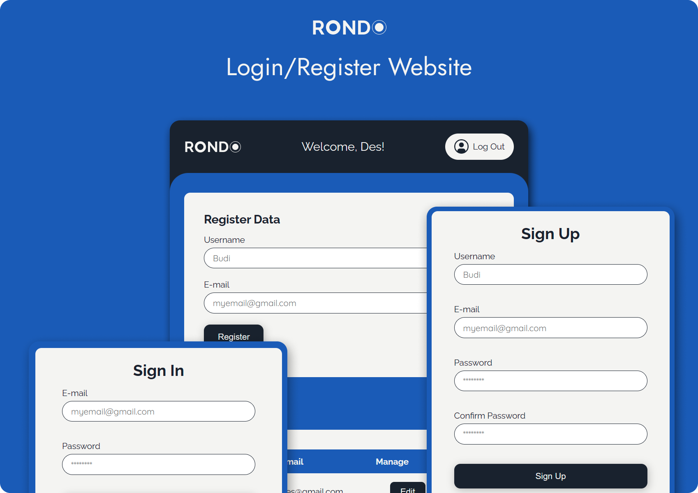

# Login/Register Website

## 👋 Greetings!

This is a simple Login/Register website using designs from the previous website project [RONDO](https://rondobags.netlify.app/). The goal was to implement validation checks when user creates an account or sign in to a website, and how user manages data using CRUD operations. I learn a lot by working on this project and I hope you do too ✌️.

## Link to Website

### [https://rondo-dashboard.netlify.app/](https://rondo-dashboard.netlify.app/)

## 🛠️ Tools

